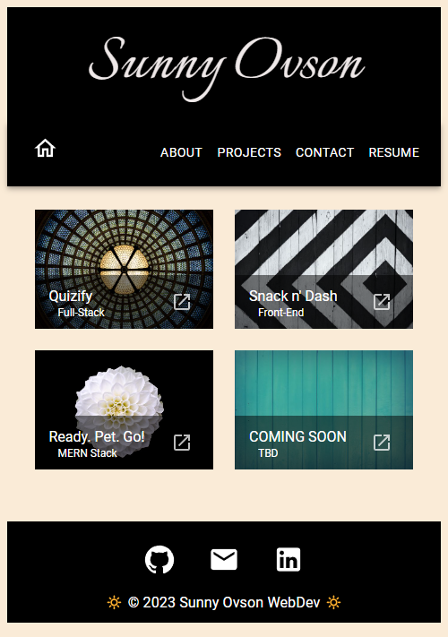

# Sunny Ovson WebDev Portfolio (ReactJS)

 

## Description
Refreshed professional Dev Portfolio featuring ReactJS front-end with MUI framework.

## Table of Contents

- [Installation](#installation)
- [Usage](#usage)
- [Technology Stack](#technology-stack)
- [Credits](#credits)
- [License](#license)
- [Contact](#contact)

## Installation

This is deployed as a live webpage through GitHub Pages and can be accessed here: [Sunny Ovson Portfolio](https://sunnyohk.github.io/sunny-ovson-react-portfolio/)

## Usage 

### Browser View :

Hompage features an introduction, navigation pane with theme toggle, and profile image change functionality.

### Fully Mobile-Responsive :

Each page/view within my portfolio has been customized to fit onto all screen sizes greater than 500px. Try it out!

### Theme Toggling : 

In the top right corner of the navigation pane, the color scheme for the entire application may be changed. This toggle option is not available on screen sizes smaller than 600px. 

### Carousel Storyline :

Feel free to flip through the carousel to learn about my journey into coding!

### Resume Preview with Download :

Although my newest resume is currently under construction, you can download and view the current copy from the Resume page.

## Technology Stack

|  | Tech Stack | Description |
| ---- | --- | --- |
| Foundation |  |  |
|  | JavaScript | Scripting language for webpages |
|  | React | Javascript Framework |
|  | MUI | React component library |

## Credits
- Alex Gonzalez: EdX Tutor

## License
This project is licensed under: [MIT](https://choosealicense.com/licenses/mit/)
 

## Contact

For questions, please contact me:

### GitHub: 
  &nbsp;&nbsp;&nbsp; [SunnyOhK](https://github.com/SunnyOhK)
### Project Link: 
  &nbsp;&nbsp;&nbsp; https://github.com/SunnyOhK/sunny-ovson-react-portfolio
### Email: 
  &nbsp;&nbsp;&nbsp; 127900916+SunnyOhK@users.noreply.github.com
